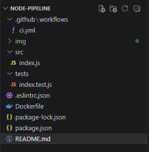
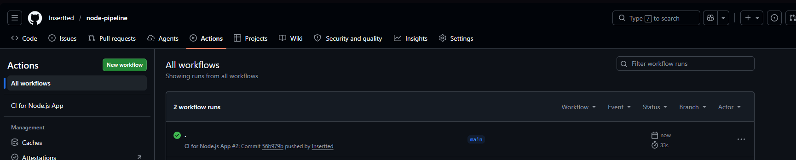
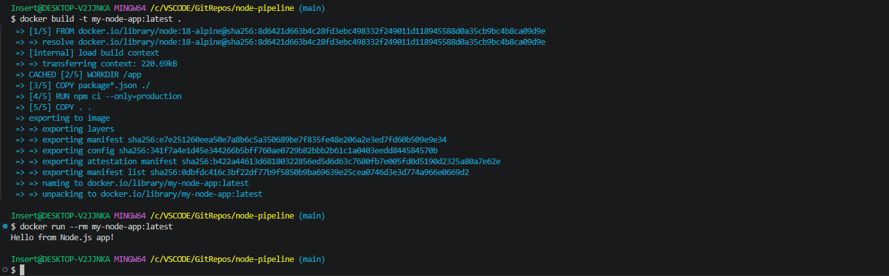

# node-pipeline

Pipeline CI на Node.js в GitHub Actions
Цель — учебный пример — простой проект, который можно склонировать, настроить и убедиться, что приложение в контейнере с Node.js, и GitHub Actions работает

Сборка через actions:

Сборка через докер файл:
